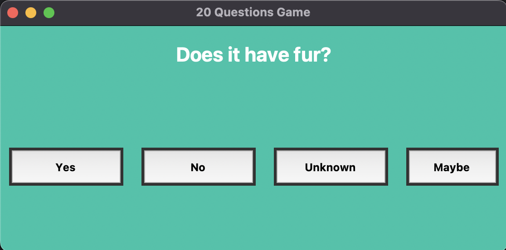
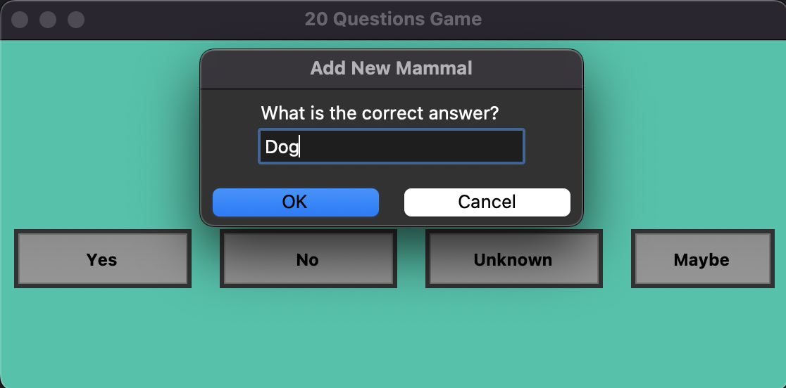
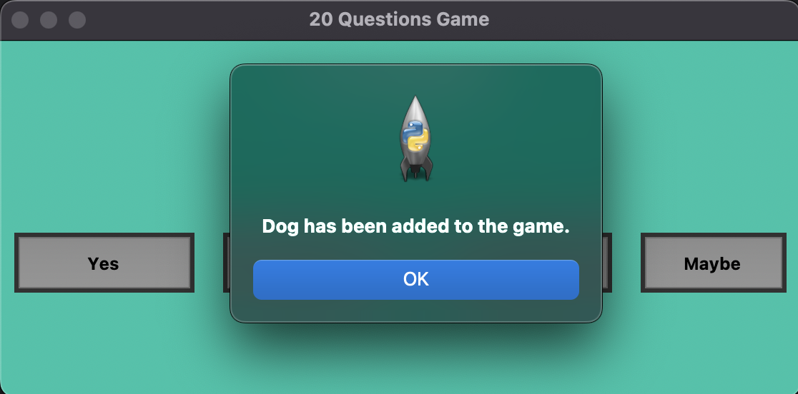
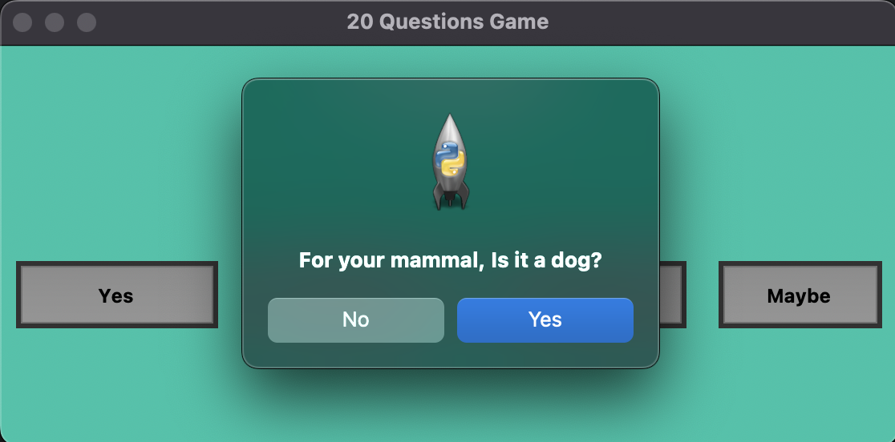
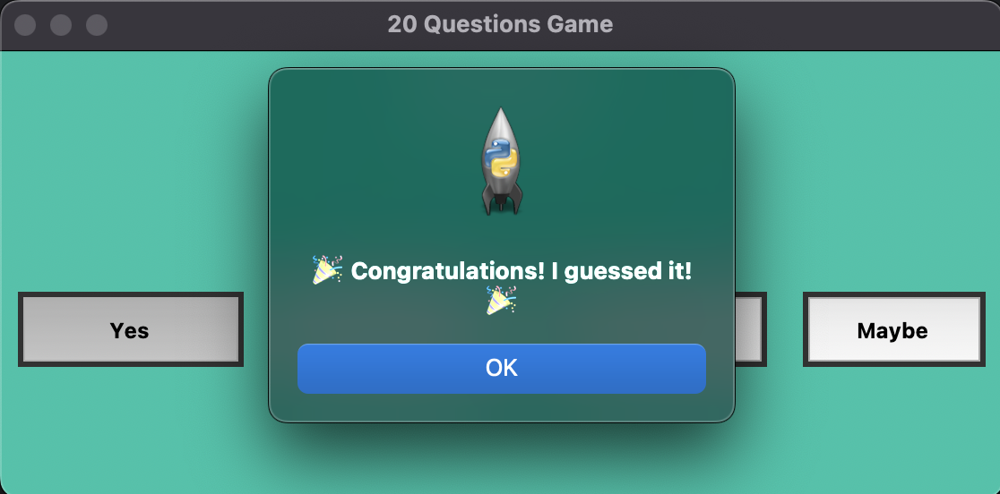

# :crystal_ball: 20 Questions Game :crystal_ball:

## Summary

This Python project implements a classic 20 questions game using a Binary Tree structure, allowing the program to learn and improve through user interaction. It features a user-friendly GUI built with Tkinter, offering an engaging and intuitive experience. The game can adapt by "learning" from users' answers, making it increasingly accurate over time. Have not completed yet, few bugs here and there. 

## Resources & Tools
- Custom data set + trainable from user input
- Tkinter for GUI
- Python

## Contact
Buyantogtokh Khurelbaatar [LinkedIn](https://www.linkedin.com/in/khurel/) - vicekurel@gmail.com 